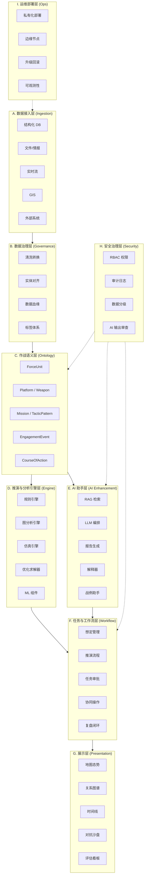
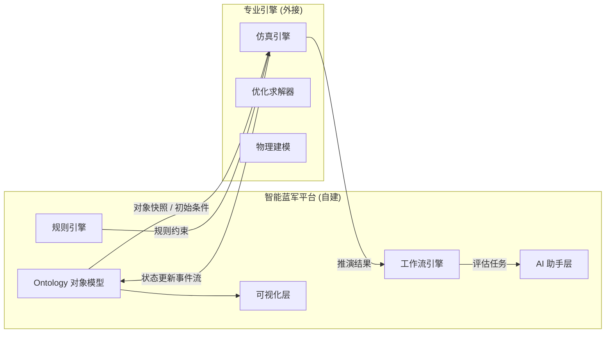
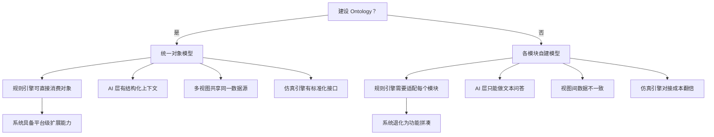
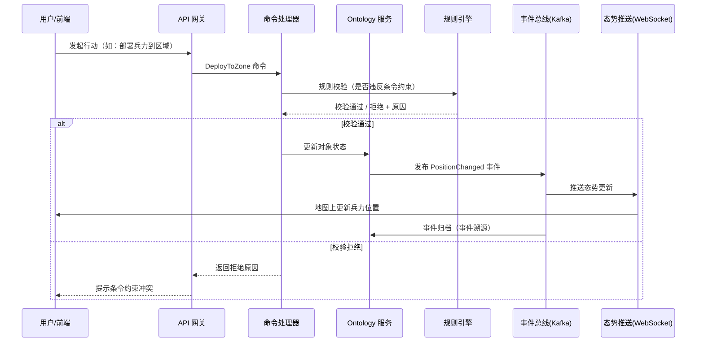
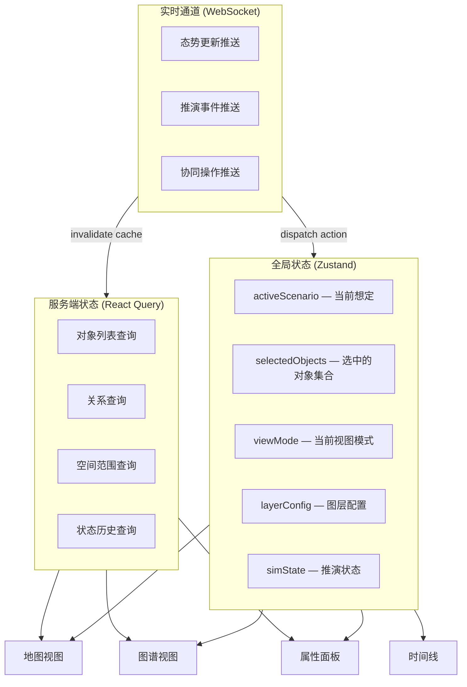
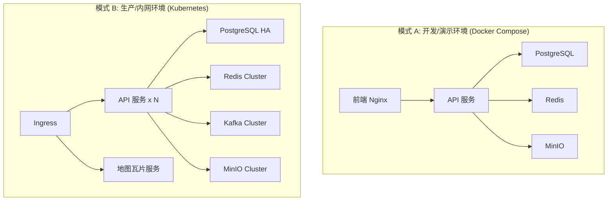

# 智能蓝军系统 — 技术架构讨论

> 基于 [调研报告](file:///e:/front-end-projects/15s-temp/ai-blue-sium/doc/palantir-intelligent-blue-force-research.md) 的核心发现，聚焦架构设计层面的关键决策。

---

## 一、调研报告核心结论回顾

在进入架构讨论前，先锚定三条核心结论：

1. **Palantir 强在平台协同，不强在专用推演内核替代** — 我们要构建的是「平台 + 专业引擎」的组合，而非单体系统
2. **系统必须以对象模型和规则闭环为骨架** — Ontology 层是整个架构的枢纽
3. **AI 适合作为增强层，不应直接充当裁决层** — LLM/Agent 做检索、解释、草案；规则引擎/仿真引擎做确定性裁决

---

## 二、系统定位讨论（需确认）

调研报告提出了 5 种可能定位，它们并不互斥，但**优先级不同**会直接影响架构重心:

| 定位方向 | 架构重心 | 第一阶段是否覆盖 |
|---|---|---|
| 演训蓝军系统 | 仿真引擎 + 想定管理 | ⭐ 建议核心 |
| 威胁建模系统 | Ontology + 情报融合 | ⭐ 建议核心 |
| 对抗推演系统 | 规则引擎 + 博弈内核 | 第二阶段 |
| 指挥训练辅助 | 工作流 + 协同 | 第二阶段 |
| 战例分析/方案生成 | AI + 知识库 | 第三阶段 |

> [!IMPORTANT]
> **建议定位**：以「威胁建模 + 演训蓝军」为核心，逐步扩展对抗推演和 AI 辅助能力。
> 这意味着第一阶段的交付重心是：**Ontology 对象模型 + 数据融合底座 + 态势可视化工作台**。

---

## 三、分层架构蓝图

基于报告第 8.1 节的分层建议，结合实际工程化需求，建议以下九层架构：



### 各层职责与关键设计决策

#### A. 数据接入层

| 决策点 | 选项 | 建议 |
|---|---|---|
| 消息中间件 | Kafka / RabbitMQ / NATS | Kafka（事件溯源 + 高吞吐） |
| 结构化存储 | PostgreSQL / MySQL | PostgreSQL（PostGIS 支持） |
| 时序/流存储 | ClickHouse / TimescaleDB | 取决于查询模式，建议先调研 |
| 文件/非结构化 | MinIO / 本地 FS | MinIO（S3 兼容） |

#### B. 数据治理层

- 建议引入**元数据管理**框架，统一管理数据血缘、标签和版本
- 实体对齐（Entity Resolution）是关键难点：同一编队在不同来源中可能有不同标识

#### C. 作战语义层（Ontology）— 架构核心

> [!IMPORTANT]
> 这是整个系统的**枢纽层**。所有上层能力（推演、AI、工作流、可视化）都围绕 Ontology 构建。

**核心对象模型**（报告 4.2 节 + 5.3 节综合）：

```
┌─────────────────────────────────────────────────────────────┐
│                    作战语义对象模型                            │
├─────────────────────────────────────────────────────────────┤
│                                                             │
│  ForceUnit ──隶属──> ForceUnit                              │
│      │                                                      │
│      ├── 装备 ──> Platform ──> Weapon / Sensor              │
│      │                                                      │
│      ├── 执行 ──> Mission ──> CourseOfAction                │
│      │                                                      │
│      ├── 采用 ──> TacticPattern                             │
│      │                                                      │
│      ├── 部署于 ──> GeoZone                                 │
│      │                                                      │
│      └── 参与 ──> EngagementEvent ──> Assessment            │
│                                                             │
│  ThreatActor ──威胁──> BattlefieldEntity                    │
│                                                             │
└─────────────────────────────────────────────────────────────┘
```

**关键机制**：
- **时态属性**：对象状态随推演时间变化（如兵力损耗、位置移动）
- **事件驱动**：通过 `EngagementEvent` 触发状态迁移
- **规则挂载**：条令约束直接关联到对象类型和关系类型上
- **权限挂载**：不同角色对不同对象粒度有不同操作权限

> [!WARNING]
> 报告指出 Ontology 建模成本极高，不可能一次设计完整。**建议采用渐进式建模**：
> - 第一阶段只覆盖 `ForceUnit`、`Platform`、`GeoZone`、`Mission` 四类核心对象
> - 每个阶段根据业务需求扩展

#### D. 推演与分析引擎层

这是「平台 + 专业引擎」路线的关键分界点：

| 引擎类型 | 职责 | 自建 vs 外接 |
|---|---|---|
| 规则引擎 | 条令约束、事件触发、状态转换 | **自建**（核心） |
| 图分析引擎 | 指挥链/补给链/关联分析 | 自建或集成 Neo4j |
| 仿真引擎 | 兵棋推演、离散事件仿真 | **外接**专业引擎 |
| 优化求解器 | 资源分配、路径规划 | 外接（如 OR-Tools） |
| ML 组件 | 预测、分类模型 | 按需集成 |

> [!NOTE]
> 规则引擎是平台与仿真引擎的**桥梁**。它消费 Ontology 对象的状态变化事件，应用条令规则，输出行动约束和触发信号给仿真引擎。

#### E. AI 助手层

报告明确指出 AI 应处于**增强层而非裁决层**。设计原则：

```
┌──────────────────────────────────────────────────┐
│           AI 受控执行框架                          │
├──────────────────────────────────────────────────┤
│                                                  │
│  输入侧                                          │
│  ├── RAG: Ontology 对象检索 + 战例库               │
│  ├── 权限过滤: 用户可见范围内的数据                  │
│  └── 上下文约束: 任务相关对象子图                    │
│                                                  │
│  执行侧                                          │
│  ├── Function Calling → 调用平台 API              │
│  ├── 规则校验 → 输出不违反条令约束                  │
│  ├── Human-in-the-Loop → 关键动作需人工确认         │
│  └── 审计记录 → 每次调用可追溯                      │
│                                                  │
│  输出侧                                          │
│  ├── 结构化行动建议（非自由文本）                    │
│  ├── 风险清单 + 依据溯源                           │
│  └── 可执行任务草案（接入工作流）                    │
│                                                  │
└──────────────────────────────────────────────────┘
```

**推荐 Agent 角色**（报告 5.5 节）：

| Agent | 职责 | 阶段 |
|---|---|---|
| Intel Agent | 情报摘要、威胁研判 | 第三阶段 |
| Planner Agent | 蓝军方案草案生成 | 第三阶段 |
| Evaluation Agent | 推演复盘评估 | 第三阶段 |
| Report Agent | 报告自动生成 | 第三阶段 |
| Simulation Agent | 仿真参数组织 | 第四阶段 |

#### F-G. 任务层 + 展示层

- **任务层**：想定 → 兵力配置 → 推演执行 → 结果评估 → 复盘归档的全流程管理
- **展示层**：地图、图谱、时间线、沙盘等多视图联动

#### H-I. 安全治理 + 运维部署

- 安全治理从第一天起就要内建，而非事后补充
- 部署方案必须支持私有化/内网/边缘节点

---

## 四、「平台 + 专业引擎」的衔接架构

报告 6.1 节明确了能力边界。两者的衔接方式是架构设计的**关键分界点**：



**衔接接口设计建议**：
1. **对象快照接口**：平台向引擎推送 Ontology 对象的当前状态快照（JSON/Protobuf）
2. **事件流接口**：引擎向平台推送状态变更事件（Kafka 主题）
3. **规则约束接口**：平台向引擎下发当前激活的规则集
4. **结果回收接口**：推演完成后，引擎向平台回传完整推演日志

---

## 五、建设阶段与 MVP 建议

### MVP / 第一阶段范围建议

> [!TIP]
> MVP 的目标是**验证 Ontology 驱动的系统架构可行性**，而非交付完整智能能力。

| 交付物 | 说明 |
|---|---|
| 对象模型定义 | ForceUnit / Platform / GeoZone / Mission 四类核心对象 |
| 数据接入 | 至少支持结构化数据库 + JSON/CSV 导入 |
| 对象管理 | CRUD + 关系编辑 + 基础查询 |
| 态势工作台 | 地图 + 兵力部署可视化 + 对象详情面板 |
| 想定管理 | 创建/编辑/版本化蓝军想定 |
| 基础安全 | RBAC 角色权限 + 操作日志 |

### 建设节奏

```mermaid
gantt
    title 智能蓝军系统建设路线
    dateFormat  YYYY-Q
    axisFormat  %Y-Q%q

    section 第一阶段
    数据融合 + Ontology 核心    :a1, 2026-Q2, 2026-Q4
    态势工作台                  :a2, 2026-Q3, 2026-Q4

    section 第二阶段
    规则引擎                    :b1, 2026-Q4, 2027-Q2
    仿真引擎对接                :b2, 2027-Q1, 2027-Q2
    推演闭环                    :b3, 2027-Q1, 2027-Q3

    section 第三阶段
    AI 助手层                   :c1, 2027-Q2, 2027-Q4
    战例库 + RAG                :c2, 2027-Q3, 2027-Q4

    section 第四阶段
    边缘部署                    :d1, 2027-Q4, 2028-Q2
    多域协同                    :d2, 2028-Q1, 2028-Q2
```

---

## 六、需要讨论确认的开放问题

> [!CAUTION]
> 以下问题的答案将直接影响架构设计的方向，建议在正式开发前逐一明确。

### 🔴 P0 — 必须先确认

1. **系统定位优先级**：是以「演训蓝军 + 威胁建模」为核心，还是有其他侧重？
2. **Ontology 建模决心**：是否投入资源做统一对象模型？如果不做，系统上限会受限
3. **仿真引擎策略**：是否已有可对接的仿真引擎？还是需要从零选型/开发？
4. **前端技术栈**：延续当前项目的技术栈，还是重新选型？

### 🟡 P1 — 第一阶段内确认

5. **数据来源**：第一阶段需要接入哪些数据源？格式和实时性要求？
6. **部署环境**：目标运行环境是什么？（云/内网/混合）
7. **团队能力**：团队在图数据库、规则引擎、仿真领域的经验如何？

### 🟢 P2 — 后续阶段再决策

8. **AI 模型选型**：使用开源模型还是商业 API？是否需要离线运行？
9. **多域协同范围**：需要与哪些外部系统对接？

---

## 七、第一阶段技术架构与选型建议

> [!IMPORTANT]
> 本章仅面向**第一阶段（MVP/首期交付）**的技术选型与架构边界，不讨论第八章及以后关于长期演进的展开设计。
> 选型原则以“**JavaScript/TypeScript 生态统一优先、可快速落地、为后续演进保留边界**”为核心。

### 7.1 选型原则

第一阶段技术架构遵循以下原则：

1. **统一生态优先**  
   整体以 `JavaScript / TypeScript` 为主生态，降低团队认知切换成本，提升前后端协作效率。仅在 AI 编排、模型调用适配、特定数据处理场景下局部引入 `Python`。

2. **MVP 可交付优先**  
   第一阶段目标是尽快完成“对象建模 + 态势展示 + 想定管理 + 基础 AI 能力接入”的可运行闭环，不引入当前阶段并非刚需的重型基础设施。

3. **主数据统一、扩展能力后置**  
   以 `PostgreSQL + PostGIS` 作为第一阶段主数据底座，统一承载对象、关系、空间和状态数据。图分析、复杂事件分发、正式规则平台等能力在后续阶段按需补齐。

4. **边界先行，组件后补**  
   虽然第一阶段不引入规则引擎、消息队列、图数据库，但在架构设计上必须预留清晰边界，避免后续演进时产生大规模重构。

### 7.2 第一阶段总体技术栈

| 层级 | 第一阶段选型 | 说明 |
|---|---|---|
| 前端框架 | `Vue 3.5 + TypeScript` | 作为统一前端开发基础 |
| 路由 | `vue-router` | 承载多视图、多工作台导航 |
| 状态管理 | `Pinia` | 负责全局状态与跨模块状态协同 |
| UI 框架 | `Element Plus` | 满足中后台工作台场景的组件需求 |
| 数字地球 / 地图引擎 | `Cesium` | 用于三维态势展示、空间对象可视化 |
| 前端构建 | `Vite` | 保持较高开发效率与构建速度 |
| 后端框架 | `Hono + Node.js` | 作为主要 API 与应用服务框架 |
| AI 辅助能力 | `Python（局部）` | 仅用于必要的 AI 编排或模型适配任务 |
| 主数据库 | `PostgreSQL + PostGIS` | 承载对象、关系、空间、时态等核心数据 |
| AI 编排 / RAG | `LangChain` | 作为第一阶段 RAG 与知识增强主方案 |
| 实时通信 | `WebSocket` | 用于态势刷新、推送事件、协同更新 |
| 部署方式 | `本地/单机/轻量服务部署` | 第一阶段不引入 Kubernetes |
| 监控 | `暂不建设正式监控体系` | 当前阶段以日志、人工排查、轻量健康检查为主 |

### 7.3 前端技术方案

前端采用 `Vue 3.5 + TypeScript` 作为统一技术基础，满足复杂工作台、态势展示和配置管理场景的开发需求。

#### 关键组件分工建议

- `Vue 3.5`
  - 承载页面与业务组件开发
  - 适配复杂交互工作台
- `vue-router`
  - 支撑“态势工作台 / 对象管理 / 想定管理 / AI 辅助分析”等多模块路由组织
- `Pinia`
  - 管理用户会话、当前想定、选中对象、地图联动状态、全局筛选条件等共享状态
- `Element Plus`
  - 承载表单、表格、弹窗、树形结构、抽屉等配置管理类界面
- `Cesium`
  - 承载三维地图、对象布势、轨迹回放、区域标绘等空间可视化能力

#### 前端架构原则

1. **地图引擎与业务 UI 解耦**  
   `Cesium` 场景管理应作为独立模块封装，不应将地图对象操作分散到各页面组件中。

2. **状态分层管理**  
   - 页面局部状态：组件内部处理  
   - 跨页面共享状态：由 `Pinia` 管理  
   - 服务端异步数据：通过统一请求层管理，不直接散落在组件生命周期中

3. **工作台优先于营销型页面**  
   本系统属于典型的复杂业务工作台，不追求轻展示型前端结构，应优先保证可维护性和空间交互性能。

### 7.4 后端技术方案

后端第一阶段采用 `Hono + Node.js` 作为主框架，统一承载 API、业务编排、对象管理、想定管理、事件记录、实时推送等服务能力。

#### 选择理由

1. **生态统一**  
   与前端共享 `TypeScript / JavaScript` 生态，降低心智负担。

2. **MVP 开发效率高**  
   `Hono` 足够轻量，适合第一阶段快速建立清晰的 API 分层。

3. **适合边界清晰的服务设计**  
   有利于构建“接口层 → 应用服务层 → 领域逻辑层 → 数据访问层”的清晰结构，而不是一开始就引入过重框架。

#### Python 的定位

第一阶段不将 Python 作为主业务后端，仅在以下场景中局部引入：

- AI 编排中的特定模型调用适配
- 文本处理、向量化、知识预处理
- JS 生态下暂不适合实现的算法型任务

原则上：

- 核心业务主流程仍由 Node 服务控制
- Python 服务仅作为局部能力提供方
- 不形成“双主后端架构”

### 7.5 数据库与主数据底座

第一阶段数据库继续采用 `PostgreSQL + PostGIS`，并沿用当前文档所提出的对象模型、关系模型、空间模型、时态模型设计方向，作为系统唯一主事实来源。

#### 定位

`PostgreSQL + PostGIS` 在第一阶段承担以下角色：

- 对象主表存储
- 对象关系存储
- 空间几何数据存储
- 想定与状态变化存储
- 事件日志与审计记录存储
- 后续 AI 检索所需的结构化上下文存储

#### 原则

1. **所有核心对象必须有统一主键和类型标识**
2. **所有关键关系必须显式建模，不允许长期隐含在前端状态或零散业务表中**
3. **空间数据统一进入 PostGIS，不在业务代码中自行维护地理计算真相**
4. **数据库是当前阶段唯一主数据来源，避免多源事实冲突**

### 7.6 AI 层技术方案

第一阶段 AI 层以 **RAG（Retrieval-Augmented Generation）** 为主，不直接把大模型嵌入核心事务链路，而是定位为“辅助分析与知识增强层”。

#### 选型

- 首选框架：`LangChain`
- 主语言生态优先：`JavaScript / TypeScript`
- 局部需要时可引入 `Python LangChain` 生态能力

#### 第一阶段 AI 适用范围

- 文档与知识库问答
- 面向对象模型与想定数据的辅助检索
- 结构化数据 + 文档信息的联合分析
- 生成解释性文本、摘要、辅助结论

#### 不建议在第一阶段承担的职责

- 直接决定核心业务状态变更
- 替代规则校验
- 作为唯一事实判断来源

#### 原则

AI 层输出应被视为“辅助建议”而非“事务真相”，核心对象状态、想定状态、规则裁定结果仍应以应用服务和数据库记录为准。

### 7.7 第一阶段暂缓引入的基础设施

以下能力在第一阶段不作为必选组件引入：

| 能力 | 当前是否引入 | 原因 |
|---|---|---|
| 规则引擎 | 否 | 第一阶段规则复杂度有限，可先由应用层规则模块承接 |
| 消息队列 | 否 | 当前并发与解耦压力有限，可先以事件记录 + WebSocket 支撑 |
| 图数据库 | 否 | 第一阶段主需求仍可由 PostgreSQL 承载 |
| 对象存储 | 否 | MVP 阶段暂不作为核心能力建设 |
| 容器编排 | 否 | 当前不需要 Kubernetes |
| 完整监控体系 | 否 | 当前不需要 Prometheus/Grafana 等正式体系 |

这并不意味着这些能力不重要，而是意味着第一阶段更强调**清晰边界 + 最小闭环**，待业务需求和系统复杂度上升后再增量引入。

### 7.8 暂缓能力的替代策略

为了确保后续可演进，第一阶段需要为暂缓项提供可替代方案。

#### 1. 规则引擎替代策略

第一阶段先采用 **TypeScript 应用层规则模块** 实现规则判断，不引入独立规则平台。

建议形式：

- 将规则判断统一放入独立的规则服务模块
- 规则输出统一为：通过 / 拒绝 / 告警 / 解释信息
- 避免将规则直接写死在控制器或前端组件中

这样后续若需引入正式规则引擎，只需替换规则执行器，而不必重构所有业务入口。

#### 2. 消息队列替代策略

第一阶段不引入 `Kafka` / `NATS`，先采用以下机制：

- 数据库事件记录表
- 应用内事件分发
- `WebSocket` 实时推送
- 必要时使用后台 worker 处理轻量异步任务

这意味着当前阶段先实现“**有事件概念，但不依赖独立消息基础设施**”。

未来若需引入消息队列，可将数据库事件表或应用事件流逐步替换为正式消息总线。

#### 3. 图数据库替代策略

第一阶段不引入 `Neo4j` 等图数据库，先由 `PostgreSQL` 负责：

- 对象表
- 关系表
- 递归关系查询
- 基础关联分析

只有在出现以下场景时，再考虑引入图数据库：

- 深层关系跳数分析明显增多
- 多类复杂关联查询性能成为瓶颈
- 需要专门的图分析算法能力

未来图数据库建议作为**分析增强层**引入，而不是替代当前主数据库。

#### 4. LLM + RAG 与图数据库的关系边界

需要明确：`LLM + RAG` **不能替代**系统中的结构化对象关系建模，也不能替代图数据库所擅长的确定性关系计算；它更适合作为解释层、辅助检索层和语义入口。

`LLM + RAG` 能解决的问题主要包括：

- 对文档、报告、规则文本进行语义检索与摘要
- 对结构化结果生成自然语言解释
- 在对象、事件、关系之上提供问答式访问入口
- 将“用户问题”转译为“结构化查询意图”

但它不适合单独承担以下职责：

- 作为系统关系真相来源
- 替代对象之间的显式关系存储
- 替代多跳关系遍历、路径分析、连通性分析等确定性图计算
- 在需要可审计、可重复、可验证的场景中充当最终裁决者

因此，本系统的推荐分工是：

- **关系建模层**：仍由 `PostgreSQL` 中的对象表、关系表和空间表承载
- **图分析层**：在后续确有复杂图分析需求时，再补充图数据库或图分析引擎
- **AI 层**：负责语义检索、解释增强、查询辅助，不替代结构化建模本身

换句话说，`LLM + RAG` 可以显著降低用户理解和使用图关系数据的门槛，但不能取消对关系数据本身的建模要求。

### 7.9 第一阶段架构约束

为保证后续演进不失控，第一阶段必须遵守以下约束：

1. **命令处理与数据写入分离**  
   不允许控制器直接拼装复杂业务写库逻辑。

2. **规则判断统一入口**  
   即使暂时不用正式规则引擎，也必须有独立规则执行边界。

3. **事件必须留痕**  
   所有关键业务动作与状态变化必须记录事件或操作日志。

4. **对象关系显式建模**  
   关系不能长期散落在前端状态、临时 JSON 字段或硬编码逻辑中。

5. **AI 与事务主链路解耦**  
   AI 可以辅助分析，但不直接成为核心业务真相来源。

### 7.10 第一阶段推荐结论

综合团队生态统一、交付效率与后续演进可控性，第一阶段推荐采用以下组合：

- **前端**：`Vue 3.5 + TypeScript + vue-router + Pinia + Element Plus + Cesium`
- **后端**：`Hono + Node.js`
- **AI 辅助**：`LangChain` 为主，必要时局部引入 `Python`
- **数据库**：`PostgreSQL + PostGIS`
- **实时能力**：`WebSocket`
- **首期暂缓**：规则引擎、消息队列、图数据库、对象存储、容器编排、完整监控体系

该方案能够在第一阶段快速形成“对象建模—想定管理—态势展示—AI 辅助分析”的基本闭环，并为后续引入更复杂基础设施保留清晰演进路径。

---

## 八、P0 开放问题决策分析

> [!IMPORTANT]
> 本节针对第六节提出的每个 P0 问题，提供决策框架、利弊分析和推荐方向。
> 这些决策之间存在强耦合关系，需要作为整体来审视。

### 8.1 系统定位优先级

#### 决策框架

系统定位不是"选一个"的问题，而是"以哪个为锚点，逐步扩展"的问题。核心判据是：

1. **用户价值密度**：哪个方向能最快让用户感受到系统价值？
2. **架构复用度**：哪个方向的底座能力可以最大程度复用到其他方向？
3. **技术风险**：哪个方向的不确定性最低，适合作为起步？

#### 三种可行路径对比

```
路径 A:  威胁建模优先 → 演训蓝军 → 对抗推演
路径 B:  演训蓝军优先 → 威胁建模 → 对抗推演
路径 C:  对抗推演优先 → 威胁建模 → 演训蓝军
```

| 维度 | 路径 A（威胁建模优先） | 路径 B（演训蓝军优先） | 路径 C（对抗推演优先） |
|---|---|---|---|
| 底座复用度 | ⭐⭐⭐ 高（Ontology 建模是所有方向的基础） | ⭐⭐ 中（想定管理偏流程，复用度一般） | ⭐ 低（仿真内核专用性强） |
| 技术风险 | ⭐⭐⭐ 低（数据建模 + 可视化，确定性强） | ⭐⭐ 中（需要仿真引擎配合） | ⭐ 高（仿真裁决是最难的部分） |
| 用户价值感知速度 | ⭐⭐ 中（需要数据积累后才有分析价值） | ⭐⭐⭐ 高（想定 + 态势可视化直接可用） | ⭐ 低（推演闭环周期长） |
| 对 AI 能力的需求时机 | 第三阶段再引入 | 第三阶段再引入 | 第二阶段就需要 |

#### 推荐决策

> **推荐路径 A 的修正版：以威胁建模（Ontology）为底座，以演训蓝军（态势工作台）为交付抓手**

理由：
- Ontology 对象模型是所有后续能力的根基——不建它，后面都是沙上建塔
- 但纯做 Ontology 对用户没有直观价值感，需要态势工作台作为**可见交付物**
- 第一阶段的交付公式 = **Ontology 核心对象 + 数据接入 + 态势可视化工作台 + 想定管理**

这样既夯实底座，又有可见可用的产品交付。

### 8.2 Ontology 建模决心

#### 核心判断

这不是一个技术问题，而是一个**战略问题**：

```
做 Ontology   → 系统是"平台"，能力上限高，但前期投入大
不做 Ontology → 系统是"工具"，能快速交付，但扩展性受限
```

#### 做与不做的长期影响



#### 推荐策略：渐进式 Ontology

不要试图一次性设计"完美模型"。采用**种子模型 + 迭代扩展**策略：

**第一阶段种子模型**（4 个核心对象 + 5 种核心关系）：

```
对象：ForceUnit / Platform / GeoZone / Mission
关系：隶属 / 装备 / 部署于 / 执行 / 参与
```

**第二阶段扩展**（+4 个对象 + 5 种关系）：

```
对象：Weapon / Sensor / TacticPattern / EngagementEvent
关系：采用 / 探测 / 打击 / 干扰 / 触发
```

**第三阶段扩展**（+3 个对象 + 3 种关系）：

```
对象：CourseOfAction / ThreatActor / Assessment
关系：威胁 / 评估 / 关联战例
```

> [!TIP]
> 关键原则：**对象模型的 schema 必须版本化**。每次扩展发布新版本，旧数据通过迁移脚本升级。
> 这避免了"一次性设计完美模型"的陷阱，同时保证了系统的演进能力。

### 8.3 仿真引擎策略

#### 现状判断与选择矩阵

仿真引擎是整个系统中**最专业、最复杂、最不应该草率决策**的部分。

| 策略 | 描述 | 适用场景 | 风险 |
|---|---|---|---|
| **外接成熟引擎** | 对接已有兵棋/仿真系统 | 已有成熟引擎可用 | 接口适配成本 |
| **采购商业引擎** | 集成商业仿真产品 | 预算充足、时间紧 | 供应商锁定、自主可控风险 |
| **自研轻量引擎** | 基于规则的离散事件仿真 | 需求明确、推演复杂度可控 | 开发周期长 |
| **第一阶段跳过** | 先不做仿真，聚焦数据建模和态势 | MVP 验证阶段 | 延迟核心能力交付 |

#### 推荐策略：分层解耦 + 延迟绑定

```
第一阶段：不引入仿真引擎，但设计好引擎对接接口
第二阶段：基于规则引擎实现"轻量推演"（状态转换 + 事件驱动）
第三阶段：对接或自研真正的仿真内核
```

**关键设计约束**：无论最终用哪种仿真引擎，平台层必须通过**标准化接口**与其交互：

```typescript
// 仿真引擎适配器接口（概念性）
interface SimulationEngineAdapter {
  // 初始化：推送 Ontology 对象快照作为初始条件
  initialize(scenario: ScenarioSnapshot): Promise<SimulationSession>;

  // 推进：按时间步/事件步推进仿真
  advance(session: SimulationSession, step: StepConfig): Promise<StateUpdate[]>;

  // 查询：获取仿真中某对象的当前状态
  query(session: SimulationSession, objectId: string): Promise<ObjectState>;

  // 终止：结束仿真并回收资源
  terminate(session: SimulationSession): Promise<SimulationReport>;
}
```

这样，无论后续选择外接引擎还是自研引擎，平台层的代码不需要修改。

### 8.4 前端技术栈

#### 决策因素

前端技术栈需要满足以下特殊需求：

1. **重度地图交互**：军事态势展示需要高性能地图引擎
2. **复杂图形渲染**：关系图谱、对抗沙盘、时间线等多种可视化
3. **实时数据更新**：推演过程中状态持续变化
4. **大数据量表格**：装备参数、兵力编成等大量结构化数据
5. **离线能力**：可能需要在断网环境运行

#### 技术选型分析

| 维度 | React + TypeScript | Vue 3 + TypeScript |
|---|---|---|
| 地图生态 | ⭐⭐⭐ Cesium/Mapbox 的 React 封装更成熟 | ⭐⭐ Vue 封装存在但稍弱 |
| 图可视化 | ⭐⭐⭐ D3/AntV G6/Cytoscape 集成顺畅 | ⭐⭐⭐ AntV 系列对 Vue 也支持良好 |
| 复杂状态管理 | ⭐⭐⭐ Zustand/Jotai 适合细粒度状态 | ⭐⭐ Pinia 足够但大型项目略显吃力 |
| 团队上手成本 | 取决于团队现有经验 | 取决于团队现有经验 |
| 国内生态 | ⭐⭐⭐ 强 | ⭐⭐⭐ 强（国内开发者占比更高） |

#### 推荐方案

> **推荐 React + TypeScript 为主框架，Cesium 为地图引擎**

具体技术栈建议：

```
框架层：    React 19 + TypeScript 5
路由：      React Router 7 / TanStack Router
状态管理：  Zustand（全局状态） + React Query（服务端状态）
UI 组件库： Ant Design 5（中后台场景成熟）
地图引擎：  Cesium（3D 态势） + Mapbox GL（2D 分析）
图可视化：  AntV G6（关系图谱） + D3（定制图表）
时间线：    vis-timeline 或自研
表格：      TanStack Table（虚拟滚动 + 大数据量）
实时通信：  WebSocket + SSE
构建工具：  Vite
```

> [!NOTE]
> 如果团队 Vue 经验显著强于 React，Vue 3 同样可行。关键不是框架选择，而是**地图引擎和可视化引擎的集成深度**。

---

## 九、Ontology 对象模型详细设计

> [!IMPORTANT]
> Ontology 层是整个系统的枢纽。本节从存储策略、Schema 设计、时态建模、事件模型四个维度展开讨论。

### 9.1 存储策略：图数据库 vs 关系数据库 vs 混合

这是一个看似简单实则影响深远的决策。

#### 三种存储策略对比

| 策略 | 实现方式 | 优势 | 劣势 |
|---|---|---|---|
| **纯图数据库** | Neo4j 为主存储 | 关系查询天然强；图遍历性能好 | 事务性弱；运维复杂度高；大批量写入性能一般 |
| **纯关系数据库** | PostgreSQL 模拟图 | 事务强；运维成熟；团队熟悉 | 深层关系查询需递归 CTE，性能下降快 |
| **混合存储** | PostgreSQL 为主 + Neo4j 为图分析 | 各取所长 | 数据同步复杂；一致性挑战 |

#### 推荐策略：PostgreSQL 为主存储 + 图分析层延迟引入

```mermaid
graph LR
    subgraph 第一阶段[\"第一阶段存储架构\"]
        PG[\"PostgreSQL\n+ PostGIS\n+ JSONB\"]
        PG --> OBJ[\"对象表\n(force_unit, platform...)\"]
        PG --> REL[\"关系表\n(object_relations)\"]
        PG --> EVT[\"事件表\n(engagement_events)\"]
        PG --> GEO[\"空间索引\n(PostGIS)\"]
    end

    subgraph 第二阶段[\"第二阶段扩展\"]
        PG2[\"PostgreSQL\"] --> SYNC[\"数据同步\"]
        SYNC --> NEO[\"Neo4j\n图分析引擎\"]
        NEO --> CHAIN[\"指挥链分析\"]
        NEO --> SUPPLY[\"补给链分析\"]
        NEO --> THREAT[\"威胁关联分析\"]
    end
```

**理由**：
1. PostgreSQL + PostGIS 已能满足第一阶段所有需求（对象 CRUD + 空间查询 + 时序数据）
2. 关系表 + JSONB 动态属性可以表达 Ontology 对象的灵活 schema
3. 深层图分析（如"查找 3 跳之内的所有关联威胁"）是第二阶段的需求
4. 到那时再引入 Neo4j 作为**只读分析层**，降低一致性风险

### 9.2 核心 Schema 设计（第一阶段）

#### 对象通用基表

```sql
-- 所有 Ontology 对象的基表，采用继承 + JSONB 动态属性的混合模式
CREATE TABLE ontology_objects (
    id              UUID PRIMARY KEY DEFAULT gen_random_uuid(),
    object_type     VARCHAR(50) NOT NULL,   -- 'force_unit', 'platform', 'geo_zone', 'mission'
    name            VARCHAR(200) NOT NULL,
    display_name    VARCHAR(200),
    status          VARCHAR(30) DEFAULT 'active',
    classification  VARCHAR(20) DEFAULT 'unclassified', -- 数据分级
    properties      JSONB DEFAULT '{}',     -- 类型特有的动态属性
    metadata        JSONB DEFAULT '{}',     -- 创建者、来源、标签等元数据
    schema_version  INTEGER DEFAULT 1,      -- 对象 schema 版本号
    created_at      TIMESTAMPTZ DEFAULT NOW(),
    updated_at      TIMESTAMPTZ DEFAULT NOW(),
    created_by      UUID REFERENCES users(id),

    -- 分区索引
    CONSTRAINT valid_object_type CHECK (
        object_type IN ('force_unit', 'platform', 'weapon', 'sensor',
                        'geo_zone', 'mission', 'tactic_pattern',
                        'engagement_event', 'course_of_action',
                        'threat_actor', 'assessment')
    )
);

-- GIN 索引支持 JSONB 查询
CREATE INDEX idx_objects_properties ON ontology_objects USING GIN (properties);
CREATE INDEX idx_objects_type_status ON ontology_objects (object_type, status);
```

#### 关系表

```sql
-- 对象间关系，支持时态和带属性的关系
CREATE TABLE object_relations (
    id              UUID PRIMARY KEY DEFAULT gen_random_uuid(),
    source_id       UUID NOT NULL REFERENCES ontology_objects(id),
    target_id       UUID NOT NULL REFERENCES ontology_objects(id),
    relation_type   VARCHAR(50) NOT NULL,   -- 'subordinate', 'equipped_with', 'deployed_at', ...
    properties      JSONB DEFAULT '{}',     -- 关系属性（如：从属关系的指挥权级别）
    valid_from      TIMESTAMPTZ DEFAULT NOW(),  -- 关系生效时间
    valid_to        TIMESTAMPTZ,                -- 关系失效时间（NULL = 永久有效）
    scenario_id     UUID,                       -- 关联的想定（NULL = 全局关系）
    created_at      TIMESTAMPTZ DEFAULT NOW(),

    CONSTRAINT no_self_relation CHECK (source_id != target_id)
);

CREATE INDEX idx_relations_source ON object_relations (source_id, relation_type);
CREATE INDEX idx_relations_target ON object_relations (target_id, relation_type);
CREATE INDEX idx_relations_scenario ON object_relations (scenario_id) WHERE scenario_id IS NOT NULL;
```

#### 空间扩展

```sql
-- 为需要地理位置的对象添加空间属性
CREATE TABLE object_geometries (
    object_id       UUID PRIMARY KEY REFERENCES ontology_objects(id),
    position        GEOMETRY(Point, 4326),       -- 点位置
    area            GEOMETRY(Polygon, 4326),     -- 区域范围
    trajectory      GEOMETRY(LineString, 4326),  -- 轨迹
    altitude_m      DOUBLE PRECISION,            -- 高度（米）
    valid_at        TIMESTAMPTZ DEFAULT NOW(),   -- 位置有效时间
    updated_at      TIMESTAMPTZ DEFAULT NOW()
);

CREATE INDEX idx_geometries_position ON object_geometries USING GIST (position);
CREATE INDEX idx_geometries_area ON object_geometries USING GIST (area);
```

### 9.3 时态建模：对象状态随推演时间变化

时态属性是军事仿真系统与普通业务系统最大的区别之一。

#### 设计方案：事件溯源（Event Sourcing）

```sql
-- 对象状态变更历史，支持任意时间点状态回溯
CREATE TABLE object_state_changes (
    id              UUID PRIMARY KEY DEFAULT gen_random_uuid(),
    object_id       UUID NOT NULL REFERENCES ontology_objects(id),
    scenario_id     UUID NOT NULL,              -- 所属想定
    sim_timestamp   TIMESTAMPTZ NOT NULL,       -- 仿真时间（不是物理时间）
    change_type     VARCHAR(30) NOT NULL,       -- 'property_update', 'status_change', 'position_move', ...
    field_path      VARCHAR(200),               -- 变更的字段路径（如 'properties.combat_power'）
    old_value       JSONB,
    new_value       JSONB,
    cause_event_id  UUID,                       -- 导致此变更的事件 ID
    created_at      TIMESTAMPTZ DEFAULT NOW()
);

CREATE INDEX idx_state_changes_object ON object_state_changes (object_id, sim_timestamp);
CREATE INDEX idx_state_changes_scenario ON object_state_changes (scenario_id, sim_timestamp);
```

**状态查询模型**：

```
当前状态 = 初始快照 + Σ(事件溯源中该对象的所有状态变更)
任意时间点状态 = 初始快照 + Σ(sim_timestamp <= T 的所有状态变更)
```

> [!WARNING]
> 事件溯源会带来数据量快速增长。建议：
> - 每个想定单独管理状态流
> - 推演完成后可生成"状态快照"用于快速查询
> - 历史想定的事件流可归档到冷存储

### 9.4 想定（Scenario）模型

想定是整个系统的**运行容器**——所有推演、态势、评估都在某个想定的上下文中进行。

```sql
CREATE TABLE scenarios (
    id              UUID PRIMARY KEY DEFAULT gen_random_uuid(),
    name            VARCHAR(200) NOT NULL,
    description     TEXT,
    status          VARCHAR(30) DEFAULT 'draft',  -- draft/active/completed/archived
    scenario_type   VARCHAR(50),                   -- 'training', 'analysis', 'wargame', ...
    parent_id       UUID REFERENCES scenarios(id), -- 支持想定派生（基于已有想定创建变体）
    version         INTEGER DEFAULT 1,
    time_config     JSONB NOT NULL DEFAULT '{      -- 想定时间配置
        "start_time": null,
        "end_time": null,
        "time_step_seconds": 300,
        "current_time": null
    }',
    config          JSONB DEFAULT '{}',            -- 想定全局配置
    created_by      UUID REFERENCES users(id),
    created_at      TIMESTAMPTZ DEFAULT NOW(),
    updated_at      TIMESTAMPTZ DEFAULT NOW()
);

-- 想定中的对象实例（同一个对象在不同想定中可有不同状态）
CREATE TABLE scenario_objects (
    scenario_id     UUID NOT NULL REFERENCES scenarios(id),
    object_id       UUID NOT NULL REFERENCES ontology_objects(id),
    side            VARCHAR(20) DEFAULT 'blue',    -- 'red', 'blue', 'neutral', 'unknown'
    initial_state   JSONB DEFAULT '{}',            -- 在此想定中的初始状态覆盖
    PRIMARY KEY (scenario_id, object_id)
);
```

---

## 十、系统核心数据流架构

### 10.1 整体数据流设计

系统中存在三种核心数据流模式，它们的特性差异很大：

```mermaid
graph TB
    subgraph 配置流[\"① 配置流 (低频/强一致)\"]
        direction LR
        CF1[\"对象模型定义\"] --> CF2[\"规则配置\"]
        CF2 --> CF3[\"想定创建\"]
        CF3 --> CF4[\"兵力配置\"]
    end

    subgraph 推演流[\"② 推演流 (高频/最终一致)\"]
        direction LR
        SF1[\"仿真步进\"] --> SF2[\"状态更新事件\"]
        SF2 --> SF3[\"规则校验\"]
        SF3 --> SF4[\"态势刷新\"]
    end

    subgraph 分析流[\"③ 分析流 (批量/异步)\"]
        direction LR
        AF1[\"推演完成\"] --> AF2[\"数据归档\"]
        AF2 --> AF3[\"图分析\"]
        AF3 --> AF4[\"AI 评估\"]
        AF4 --> AF5[\"报告生成\"]
    end

    配置流 -.->|想定快照| 推演流
    推演流 -.->|推演日志| 分析流
```

| 数据流 | 频率 | 一致性要求 | 延迟容忍度 | 推荐技术 |
|---|---|---|---|---|
| 配置流 | 低频 | 强一致 | 秒级 | REST API + PostgreSQL 事务 |
| 推演流 | 高频 | 最终一致 | 毫秒到百毫秒级 | WebSocket + Kafka + 内存状态 |
| 分析流 | 批量 | 最终一致 | 分钟级 | Kafka → 异步 Worker → 报告存储 |

### 10.2 事件驱动架构

系统以**事件**作为各层之间的通信纽带：

```
事件分类：

├── 命令事件（Command）— 表达意图
│   ├── CreateForceUnit        — 创建兵力单元
│   ├── DeployToZone           — 部署到区域
│   ├── ExecuteMission         — 执行任务
│   └── AdvanceSimulation      — 推进仿真
│
├── 领域事件（Domain Event）— 表达已发生的事实
│   ├── ForceUnitCreated       — 兵力单元已创建
│   ├── PositionChanged        — 位置已变更
│   ├── EngagementOccurred     — 交战已发生
│   ├── CasualtyApplied        — 损耗已施加
│   └── MissionCompleted       — 任务已完成
│
└── 通知事件（Notification）— 驱动 UI 和下游系统
    ├── SituationUpdated       — 态势已更新
    ├── RuleViolationDetected  — 规则违反已检出
    └── SimulationStepComplete — 仿真步进已完成
```

#### 事件流转路径



### 10.3 CQRS（命令查询分离）建议

对于推演场景，读写比例极不对称：

- **写**：推演中每步产生少量状态变更
- **读**：态势展示层需要高频查询大量对象的当前状态

建议采用轻量 CQRS：

```
写路径：  API → 命令处理 → PostgreSQL（源数据） → 事件发布
读路径：  前端 → 查询 API → 物化视图/Redis 缓存（优化后的读取模型）
```

> [!NOTE]
> 第一阶段不需要完整 CQRS。先用 PostgreSQL 视图 + Redis 缓存即可。
> 当推演并发量增长后，再考虑引入专用读模型。

---

## 十一、规则引擎架构深化

### 11.1 规则引擎在系统中的角色

规则引擎是**平台层与仿真引擎之间的桥梁**，也是保证系统行为可控、可解释的关键组件。

```
┌──────────────────────────────────────────────────────────────────┐
│                     规则引擎职责边界                               │
├──────────────────────────────────────────────────────────────────┤
│                                                                  │
│  ✅ 规则引擎负责                    ❌ 规则引擎不负责              │
│  ├── 条令约束校验                   ├── 物理级仿真计算             │
│  ├── 行动合法性判断                 ├── 武器系统效能计算            │
│  ├── 事件触发的状态转换             ├── 复杂博弈求解               │
│  ├── 资源约束检查                   ├── 路径/轨迹规划              │
│  └── 告警条件判定                   └── 统计学习/预测              │
│                                                                  │
└──────────────────────────────────────────────────────────────────┘
```

### 11.2 规则类型分类

```
规则分类：

├── 约束规则（Constraint）— 判断"能不能做"
│   ├── "某型装备的作战半径不超过 X 公里"
│   ├── "一个连级单位最多指挥 N 个排级单位"
│   └── "夜间不具备某类行动能力"
│
├── 触发规则（Trigger）— 判断"何时自动执行"
│   ├── "当兵力损耗超过 30% 时，自动触发撤退建议"
│   ├── "当敌方进入 A 区域时，触发预警事件"
│   └── "当弹药低于阈值时，触发补给请求"
│
├── 计算规则（Calculation）— 判断"结果是多少"
│   ├── "战损比计算公式"
│   ├── "作战效能评分公式"
│   └── "指挥链完整性评分"
│
└── 流程规则（Workflow）— 判断"下一步做什么"
    ├── "推演步进后，自动执行规则检查 → 状态更新 → 态势刷新"
    ├── "想定审批流：创建 → 审核 → 发布 → 锁定"
    └── "AI 输出审查流：AI 生成 → 规则校验 → 人工确认"
```

### 11.3 规则引擎选型深化

| 方案 | 实现思路 | 优势 | 劣势 | 推荐场景 |
|---|---|---|---|---|
| **Drools** | Java 生态规则引擎 | 成熟、Rete 算法性能好、支持 DSL | 重、学习曲线陡、与非 Java 后端集成不便 | 后端选 Java 时 |
| **自研 DSL** | 定义领域特定语言 + 解释器 | 完全可控、可针对军事领域定制 | 开发成本高、需要设计语言规范 | 长期投入时 |
| **JSON/YAML 规则配置 + 执行器** | 规则以结构化数据存储，通用执行器解释执行 | 灵活、前端可视化编辑友好 | 表达能力有限、复杂规则难描述 | MVP 阶段 |
| **OPA (Open Policy Agent)** | Rego 语言描述策略 | 擅长权限/策略、云原生友好 | 不适合复杂业务规则和状态计算 | 仅作为权限策略层 |

#### 推荐：第一阶段用 JSON 规则 + 自研执行器，第二阶段演进

第一阶段的规则表达示例：

```json
{
  "rule_id": "constraint_max_subordinates",
  "name": "连级最大下辖排数约束",
  "type": "constraint",
  "description": "一个连级单位最多指挥 4 个排级单位",
  "condition": {
    "object_type": "force_unit",
    "property_match": { "properties.echelon": "company" },
    "relation_count": {
      "relation_type": "subordinate",
      "target_match": { "properties.echelon": "platoon" },
      "operator": "<=",
      "threshold": 4
    }
  },
  "action": {
    "type": "reject",
    "message": "违反编制约束：连级单位下辖排级单位不应超过 4 个"
  },
  "severity": "error",
  "enabled": true
}
```

> [!TIP]
> JSON 规则配置的核心优势：**规则可被前端可视化编辑**。
> 领域专家（军事教员、参谋人员）无需编程即可配置和调整规则，大幅降低系统维护成本。

---

## 十二、前端工作台架构

### 12.1 工作台设计理念

前端不是一个"看数据的页面"，而是一个**多视图联动、实时更新的作战分析工作台**。

设计理念：
1. **多视图联动**：地图、图谱、时间线、属性面板共享同一选中对象
2. **上下文驱动**：所有视图都在当前想定的上下文中运行
3. **实时推送**：推演过程中态势自动刷新，无需手动刷新
4. **操作即命令**：用户在地图上的拖拽、点击都转化为系统命令

### 12.2 整体布局架构

```
┌────────────────────────────────────────────────────────────────────────┐
│  顶部导航栏：系统菜单 / 想定切换 / 用户信息 / 全局搜索               │
├────────────┬──────────────────────────────────┬────────────────────────┤
│            │                                  │                        │
│  左侧面板   │       主视图区域                  │    右侧面板             │
│            │                                  │                        │
│  ├ 对象树   │  ┌──────────────────────────────┐│  ├ 对象属性详情         │
│  │ (组织    │  │                              ││  │                     │
│  │  编制    │  │     地图态势 / 关系图谱       ││  ├ 关系列表             │
│  │  结构)   │  │     / 对抗沙盘               ││  │                     │
│  │         │  │     (可切换主视图模式)        ││  ├ 状态历史             │
│  ├ 图层    │  │                              ││  │                     │
│  │ 控制    │  │                              ││  ├ 规则校验结果         │
│  │         │  └──────────────────────────────┘│  │                     │
│  ├ 快速    │  ┌──────────────────────────────┐│  └ AI 助手面板          │
│  │ 筛选    │  │   时间线 / 事件流 / 日志      ││    (第三阶段)           │
│  │         │  └──────────────────────────────┘│                        │
├────────────┴──────────────────────────────────┴────────────────────────┤
│  底部状态栏：想定时间 / 推演状态 / 连接状态 / 操作日志                │
└────────────────────────────────────────────────────────────────────────┘
```

### 12.3 前端状态管理架构



### 12.4 地图引擎集成要点

Cesium 集成的关键技术决策：

| 技术点 | 建议方案 | 说明 |
|---|---|---|
| 军标绘制 | 自研军标图层 + SVG 符号库 | 标准军标渲染需自定义 |
| 大量实体渲染 | Cesium Entity API + 聚合策略 | 超过 5000 个实体时需分级加载 |
| 态势标绘 | 自研标绘工具组件 | 支持点、线、面、箭头、攻击方向等 |
| 地形数据 | 离线地形服务 | 内网部署时需本地地形瓦片服务 |
| 影像数据 | 离线影像服务 | 同上，需支持多种坐标系 |
| 坐标系 | CGCS2000 + WGS84 互转 | 国内军用场景常用 CGCS2000 |

> [!WARNING]
> 离线地图是内网部署的**关键前置条件**。必须在第一阶段就规划好地图瓦片服务的部署方案，
> 否则态势工作台在内网环境中将无法展示任何地图底图。

---

## 十三、部署架构与安全治理

### 13.1 部署拓扑设计

系统必须从第一天就支持至少两种部署模式：



### 13.2 内网部署清单

内网/专网部署是军用系统的**硬性要求**。以下组件必须支持完全离线运行：

| 组件 | 离线部署方案 |
|---|---|
| 容器镜像 | 私有 Harbor 镜像仓库 |
| npm 包 | 离线 npm registry（如 Verdaccio） |
| 地图瓦片 | 本地 GeoServer / 自建瓦片服务 |
| 地形数据 | 本地 Cesium Terrain Server |
| AI 模型 | 本地推理服务（如 vLLM / Ollama） |
| 系统更新 | 离线升级包 + 版本管理 |

### 13.3 安全架构分层

```
┌──────────────────────────────────────────────────────┐
│                   安全架构四层模型                     │
├──────────────────────────────────────────────────────┤
│                                                      │
│  L1 — 认证层                                         │
│  ├── 用户认证（JWT / OAuth 2.0 / LDAP 集成）         │
│  ├── 服务间认证（mTLS）                              │
│  └── 设备认证（离线场景下的证书认证）                  │
│                                                      │
│  L2 — 授权层 (RBAC + ABAC)                           │
│  ├── 角色权限：管理员/指挥员/参谋/教员/观察员         │
│  ├── 对象权限：不同角色可见/可编辑不同对象             │
│  ├── 想定权限：想定级别的访问控制                     │
│  └── 数据分级：对象的密级属性影响可见性               │
│                                                      │
│  L3 — 审计层                                         │
│  ├── 操作日志：所有 CRUD 操作留痕                     │
│  ├── AI 调用日志：每次 AI 调用的输入/输出/模型版本    │
│  ├── 推演日志：完整推演过程可回放                     │
│  └── 登录/权限变更日志                               │
│                                                      │
│  L4 — 数据保护层                                     │
│  ├── 传输加密：全链路 TLS                            │
│  ├── 存储加密：数据库加密 + 文件加密                  │
│  ├── 脱敏规则：导出/报告时自动脱敏                    │
│  └── 销毁机制：想定数据的安全销毁                     │
│                                                      │
└──────────────────────────────────────────────────────┘
```

### 13.4 RBAC 权限模型设计

```sql
-- 角色定义
CREATE TABLE roles (
    id          UUID PRIMARY KEY,
    name        VARCHAR(50) UNIQUE NOT NULL,     -- 'admin', 'commander', 'staff', 'instructor', 'observer'
    label       VARCHAR(100) NOT NULL,           -- '系统管理员', '指挥员', '参谋', '教员', '观察员'
    permissions JSONB NOT NULL DEFAULT '[]'      -- 权限列表
);

-- 权限矩阵示例
-- {
--   "resource": "scenario",
--   "actions": ["read", "create", "update", "delete", "execute"],
--   "constraints": { "classification_max": "secret" }
-- }
```

| 角色 | 想定管理 | 兵力编辑 | 推演执行 | 规则配置 | 报告查看 | 系统配置 |
|---|---|---|---|---|---|---|
| 管理员 | ✅ 全部 | ✅ 全部 | ✅ 全部 | ✅ 全部 | ✅ 全部 | ✅ 全部 |
| 指挥员 | 创建/编辑 | ✅ 己方 | ✅ 发起 | ❌ | ✅ 全部 | ❌ |
| 参谋 | 创建/编辑 | ✅ 己方 | ✅ 协助 | ❌ | ✅ 己方 | ❌ |
| 教员 | ✅ 查看 | ✅ 查看 | ✅ 查看 | ✅ 编辑 | ✅ 全部 | ❌ |
| 观察员 | ✅ 查看 | ✅ 查看 | ✅ 查看 | ❌ | ✅ 查看 | ❌ |

---

## 十四、下一步行动建议

> [!IMPORTANT]
> 基于以上讨论，建议按以下顺序推进下一步工作：

### 14.1 待确认决策清单

以下决策需要团队/甲方确认后才能进入详细设计：

| # | 决策项 | 本文推荐 | 影响范围 | 紧迫度 |
|---|---|---|---|---|
| D1 | 系统定位 | 威胁建模为底座 + 演训为交付抓手 | 全局 | 🔴 立即 |
| D2 | 是否做 Ontology | 是，采用渐进式 | 全局 | 🔴 立即 |
| D3 | 仿真引擎策略 | 第一阶段不引入，设计好接口 | 引擎层 | 🟡 一阶段内 |
| D4 | 后端语言 | 待讨论（Java vs Go vs 混合） | 后端 | 🔴 立即 |
| D5 | 前端框架 | React + TypeScript + Cesium | 前端 | 🔴 立即 |
| D6 | 部署环境 | 必须支持内网，Docker Compose 起步 | 运维 | 🟡 一阶段内 |

### 14.2 决策确认后的下一步文档

| 文档 | 内容 | 前置条件 |
|---|---|---|
| `Ontology Schema 规范` | 完整的第一阶段对象模型定义 | D1, D2 确认 |
| `API 设计规范` | RESTful API + WebSocket 协议定义 | D4 确认 |
| `前端工作台设计稿` | 线框图 + 交互说明 | D5 确认 |
| `部署手册` | Docker Compose + K8s 部署方案 | D6 确认 |
| `MVP 详细需求` | 第一阶段功能点拆解 + 验收标准 | D1-D6 全部确认 |
